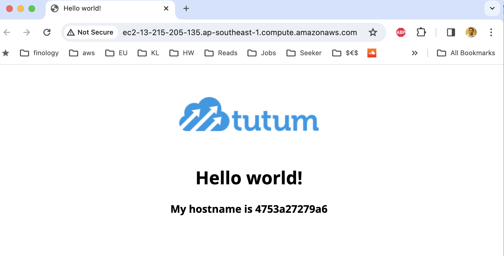

# EC2 Instance with Docker

### Configure an EC2 instance along with required security group running a sample docker container in it

- Accessible on ports:
  - `22` - ssh
  - `80` - http

### Inputs

- `ssh_connection_key_name`

### Outputs:

- `instance_id`
- `instance_sg_id`
- `instance_ip_addr`
- `instance_url`

## Screenshots

